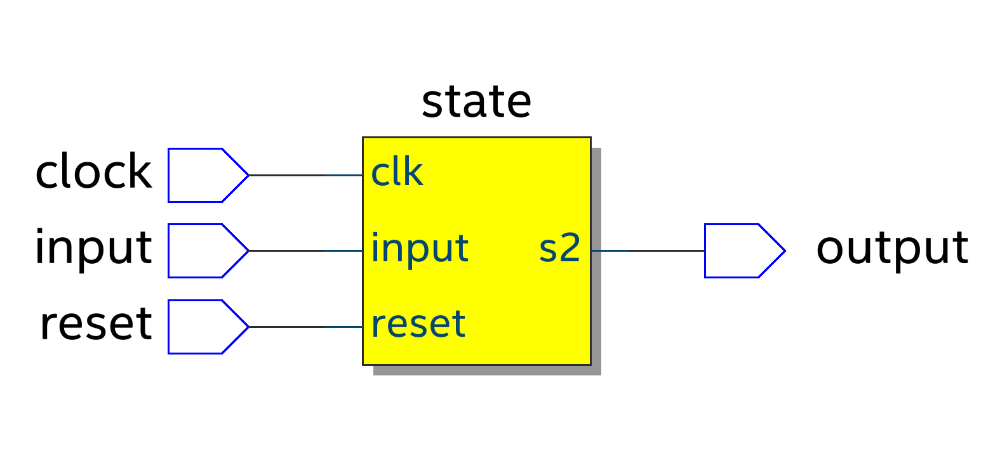
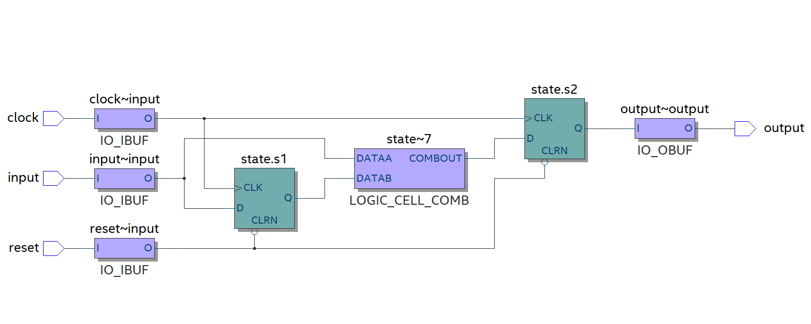
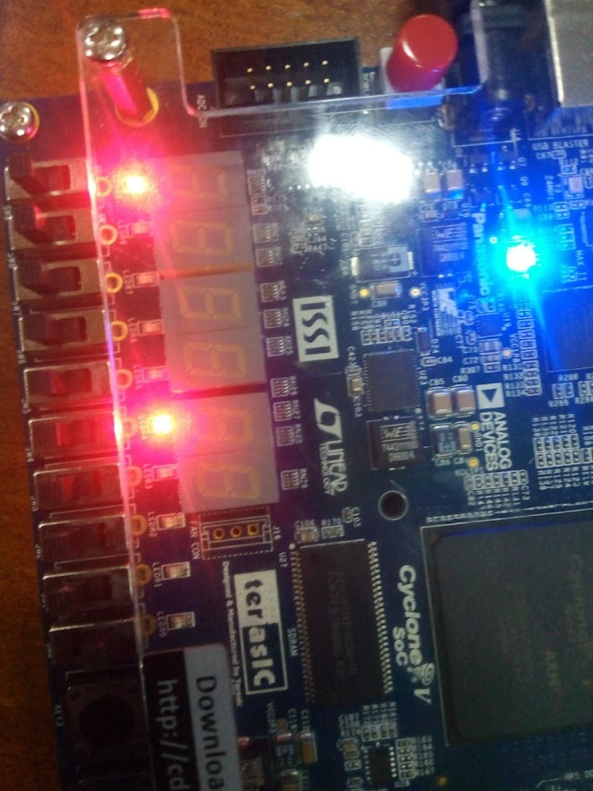
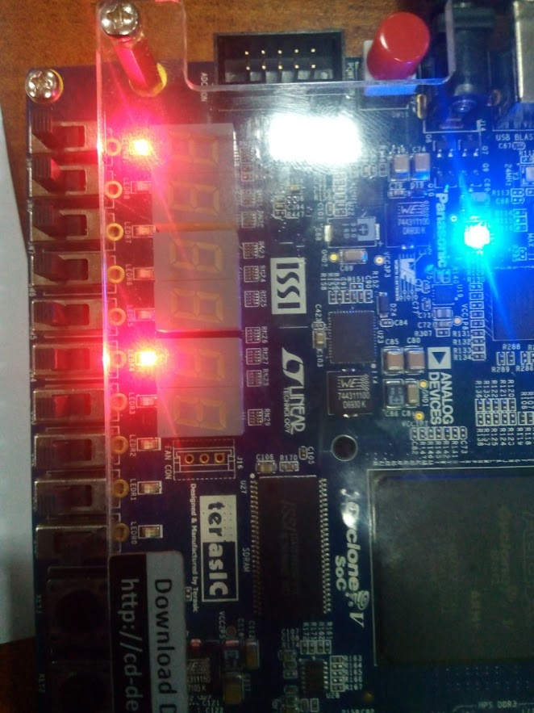
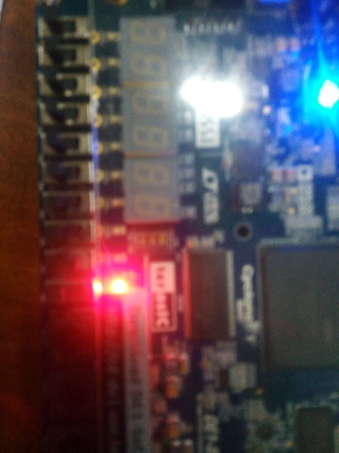
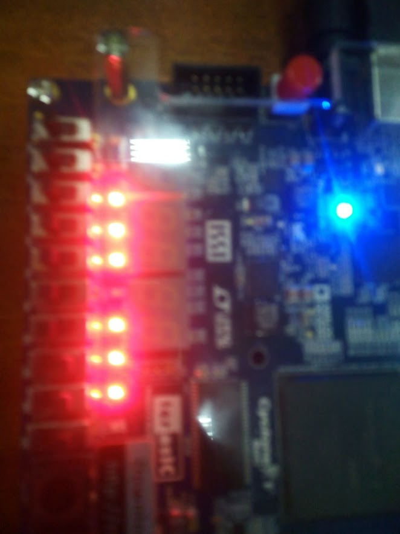
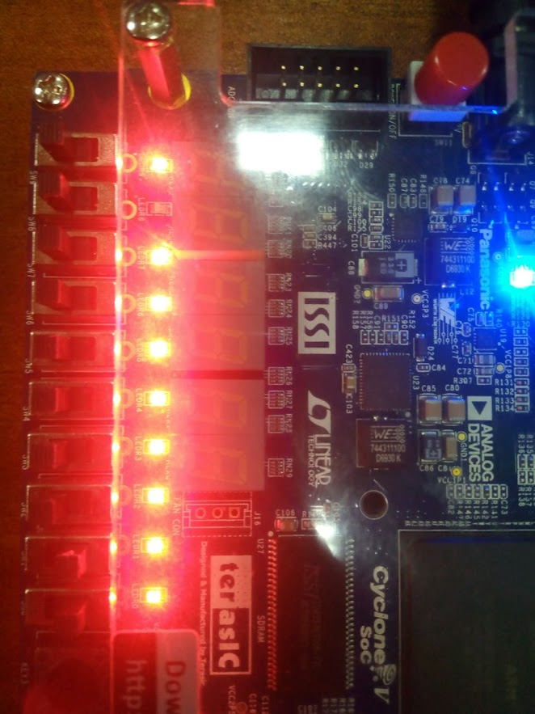

# Sequence-Detector-Moore-Machine-using-Quartus-prime-and-Cyclone

This is a VHDL project using quartus prime to detect a 10 input sequence using Moore Finite state machine. 
This finite state machine has three states based on the input values. 

**As any other finite state machine this machine has three logic parts**
- Current state logic
- Next state logic
- Output logic

  Both current state and next state logics are sequential circuit whereas the output logic is combinational logic circuit.

## How Moore Machine works 
A Moore machine operates by transitioning between different states based on input signals. Each state represents a specific mode or condition of the machine. Transitions are triggered by input conditions and lead to new states, determining the machine's behavior. Unlike other machines, a Moore machine's output is solely determined by its current state, without considering the inputs. This clear separation between states and outputs makes Moore machines useful for modeling sequential processes and digital systems.

  
### The following image shows the RTL view of the Moore Sequence detector machine

  
### The following image shows the Technology map view of the Moore Sequence detector machine

## The following images show the implementation of the project on Cyclone V FPGA board

 

 

 

 

 

 

Tewodros Seble
All Rights Reserverd
